<!--
  cardene777 — terminal profile (11 要素 / 7 ブロック構成)
  ユーザー指摘:
  - render --3d を単独要素に
  - ls projects/ を削除し、その位置に joke を移動
  - Stats が片方表示されてない (table → div + 直接並べに変更)
  - 全体 OK の方向性
-->

<br />

<div align="center">



</div>

<br />

<!-- ═══════════ 1. IDENTITY ═══════════ -->

<table>
<tr>
<td width="38%" align="center" valign="middle">


<br /><br />


<br />

<br />


</td>
<td width="62%" valign="top">


```
cardene
```


```text
Role        : Smart Contract Engineer × AI Builder
Location    : Japan
Languages   : solidity · rust · typescript · python
Frameworks  : foundry · next.js · fastapi
Editor      : claude-code + cursor + ghostty
```


<pre>
x        → <a href="https://x.com/cardene777">@cardene777</a>
zenn     → <a href="https://zenn.dev/heku">zenn.dev/heku</a>
qiita    → <a href="https://qiita.com/cardene">qiita.com/cardene</a>
blog     → <a href="https://chaldene.net">chaldene.net</a>
</pre>

</td>
</tr>
</table>

<br />

<!-- ═══════════ 3. STATS ═══════════ -->

<div align="center">


<br />


<br /><br />


</div>

<br />

<!-- ═══════════ 4. ACTIVITY ═══════════ -->

<div align="center">


<br />


</div>

<br />

<!-- ═══════════ 5. RENDER --3D (単独) ═══════════ -->

<div align="center">


<br />


</div>

<br />

<!-- ═══════════ 6. AWARDS ═══════════ -->

<div align="center">


<br />


</div>

<br />

<!-- ═══════════ 7. WAKATIME ═══════════ -->

<div align="center">

</div>

<!--START_SECTION:waka-->


**🐱 My GitHub Data** 

> 📦 2.2 MB Used in GitHub's Storage 
 > 
> 🏆 11,858 Contributions in the Year 2026
 > 
> 🚫 Not Opted to Hire
 > 
> 📜 72 Public Repositories 
 > 
> 🔑 76 Private Repositories 
 > 
**I'm an Early 🐤** 

```text
🌞 Morning                0 commits           ░░░░░░░░░░░░░░░░░░░░░░░░░   00.00 % 
🌆 Daytime                0 commits           ░░░░░░░░░░░░░░░░░░░░░░░░░   00.00 % 
🌃 Evening                0 commits           ░░░░░░░░░░░░░░░░░░░░░░░░░   00.00 % 
🌙 Night                  0 commits           ░░░░░░░░░░░░░░░░░░░░░░░░░   00.00 % 
```
📅 **I'm Most Productive on Monday** 

```text
Monday                   0 commits           ░░░░░░░░░░░░░░░░░░░░░░░░░   00.00 % 
Tuesday                  0 commits           ░░░░░░░░░░░░░░░░░░░░░░░░░   00.00 % 
Wednesday                0 commits           ░░░░░░░░░░░░░░░░░░░░░░░░░   00.00 % 
Thursday                 0 commits           ░░░░░░░░░░░░░░░░░░░░░░░░░   00.00 % 
Friday                   0 commits           ░░░░░░░░░░░░░░░░░░░░░░░░░   00.00 % 
Saturday                 0 commits           ░░░░░░░░░░░░░░░░░░░░░░░░░   00.00 % 
Sunday                   0 commits           ░░░░░░░░░░░░░░░░░░░░░░░░░   00.00 % 
```


📊 **This Week I Spent My Time On** 

```text
🕑︎ Time Zone: Asia/Tokyo

💬 Programming Languages: 
Markdown                 30 hrs 36 mins      ███████░░░░░░░░░░░░░░░░░░   26.21 % 
Text                     16 hrs 52 mins      ████░░░░░░░░░░░░░░░░░░░░░   14.45 % 
Python                   15 hrs 39 mins      ███░░░░░░░░░░░░░░░░░░░░░░   13.41 % 
TypeScript               14 hrs 56 mins      ███░░░░░░░░░░░░░░░░░░░░░░   12.79 % 
Other                    12 hrs 7 mins       ███░░░░░░░░░░░░░░░░░░░░░░   10.38 % 

🔥 Editors: 
Cursor                   93 hrs 51 mins      ████████████████████░░░░░   80.36 % 
Unknown Editor           22 hrs 56 mins      █████░░░░░░░░░░░░░░░░░░░░   19.64 % 

💻 Operating System: 
Mac                      116 hrs 47 mins     █████████████████████████   100.00 % 
```

```text

```


**Timeline**


 Last Updated on 17/05/2026 07:28:12 UTC
<!--END_SECTION:waka-->

<br />

<!-- ═══════════ 8. SNAKE ═══════════ -->

<div align="center">


<br />


</div>
