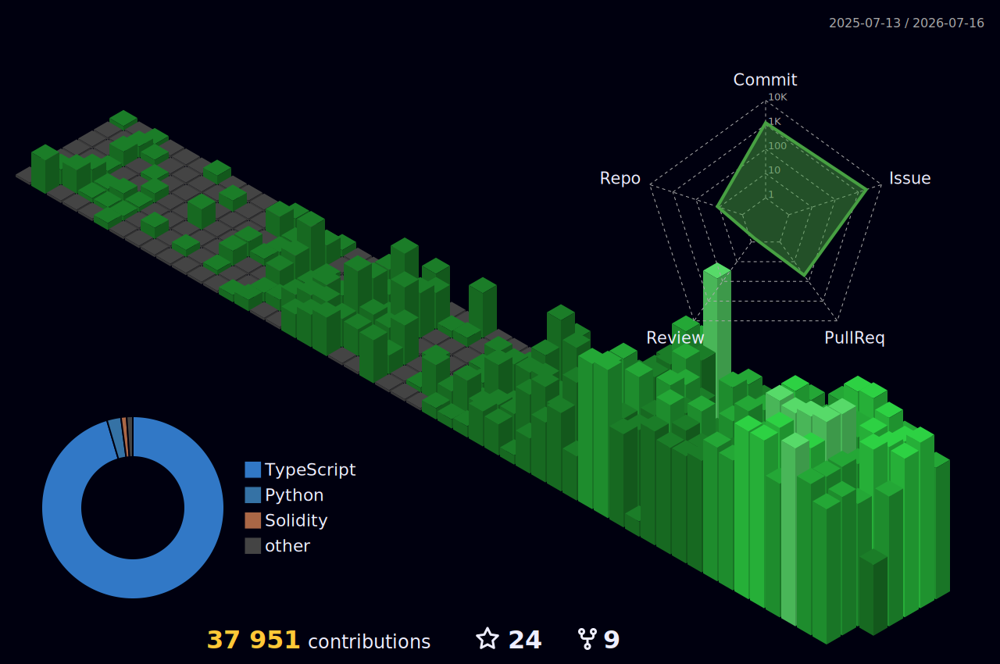

<div align="center">


</div>

---

<div align="center">

</div>

```bash
┌──────────────────────────────────────────────────────────────┐
│ NAME       cardene777                                        │
│ ROLE       Full-Stack Engineer / Web3 Developer              │
│ LOCATION   Tokyo, Japan                                      │
│ STACK      TypeScript · Solidity · Python · Next.js          │
│ FOCUS      DApps · Smart Contracts · AI/LLM Integration      │
│ STATUS     Building, learning, shipping. _                   │
└──────────────────────────────────────────────────────────────┘
```

---

<div align="center">

</div>

<div align="center">
<a href="https://github.com/anuraghazra/github-readme-stats">
  
</a>
<a href="https://github.com/anuraghazra/github-readme-stats">
  
</a>
</div>

---

<div align="center">

</div>

<div align="center">
<a href="https://git.io/streak-stats">
  
</a>
</div>

---

<div align="center">

</div>

```bash
total 4
drwxr-xr-x  cardene  staff  Web3      borderless-contract/
drwxr-xr-x  cardene  staff  Tooling   claude-config/
drwxr-xr-x  cardene  staff  AI/LLM    ai-experiments/
drwxr-xr-x  cardene  staff  Web/Blog  chaldene-net/
$ _
```

<div align="center">
<a href="https://github.com/cardene777">
  
</a>
</div>

---

<div align="center">

</div>

```bash
┌─────────────────────────────────────────────────────────┐
│ Twitter   →  https://twitter.com/cardene777             │
│ Blog      →  https://chaldene.net                       │
│ Qiita     →  https://qiita.com/cardene                  │
│ Zenn      →  https://zenn.dev/heku                      │
└─────────────────────────────────────────────────────────┘
```

<div align="center">

[](https://twitter.com/cardene777)
[](https://chaldene.net)
[](https://qiita.com/cardene)
[](https://zenn.dev/heku)

</div>

---

<div align="center">

</div>

<div align="center">
<a href="https://github.com/ashutosh00710/github-readme-activity-graph">
  
</a>
</div>

---

<div align="center">

</div>

<div align="center">
<a href="https://github.com/Platane/snk">
  
</a>
</div>

---

<div align="center">

</div>

<div align="center">

</div>

---

<div align="center">

</div>

<div align="center">
<a href="https://github.com/ryo-ma/github-profile-trophy">
  
</a>
</div>

---

<div align="center">

</div>

<div align="center">

</div>

---

<div align="center">


</div>
