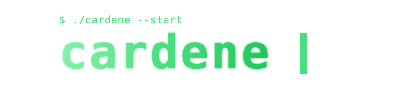

<!--
  cardene777 — terminal profile (11 要素 / 7 ブロック構成)
  ユーザー指摘:
  - render --3d を単独要素に
  - ls projects/ を削除し、その位置に joke を移動
  - Stats が片方表示されてない (table → div + 直接並べに変更)
  - 全体 OK の方向性
-->

<br />

<div align="center">



</div>

<br />

<!-- ═══════════ 1. IDENTITY ═══════════ -->

<table>
<tr>
<td width="38%" align="center" valign="middle">


<br /><br />


<br />

<br />


</td>
<td width="62%" valign="top">


```
cardene
```


```text
Role        : Smart Contract Engineer × AI Builder
Location    : Japan
Languages   : solidity · rust · typescript · python
Frameworks  : foundry · next.js · fastapi
Editor      : claude-code + cursor + ghostty
```


<pre>
x        → <a href="https://x.com/cardene777">@cardene777</a>
zenn     → <a href="https://zenn.dev/heku">zenn.dev/heku</a>
qiita    → <a href="https://qiita.com/cardene">qiita.com/cardene</a>
blog     → <a href="https://chaldene.net">chaldene.net</a>
</pre>

</td>
</tr>
</table>

<br />

<!-- ═══════════ 3. STATS ═══════════ -->

<div align="center">


<br />


<br /><br />


</div>

<br />

<!-- ═══════════ 4. ACTIVITY ═══════════ -->

<div align="center">


<br />


</div>

<br />

<!-- ═══════════ 5. RENDER --3D (単独) ═══════════ -->

<div align="center">


<br />


</div>

<br />

<!-- ═══════════ 6. AWARDS ═══════════ -->

<div align="center">


<br />


</div>

<br />

<!-- ═══════════ 7. WAKATIME ═══════════ -->

<div align="center">

</div>

<!--START_SECTION:waka-->


**🐱 My GitHub Data** 

> 📦 4.9 MB Used in GitHub's Storage 
 > 
> 🚫 Not Opted to Hire
 > 
> 📜 75 Public Repositories 
 > 
> 🔑 93 Private Repositories 
 > 
**I'm an Early 🐤** 

```text
🌞 Morning                0 commits           ░░░░░░░░░░░░░░░░░░░░░░░░░   00.00 % 
🌆 Daytime                0 commits           ░░░░░░░░░░░░░░░░░░░░░░░░░   00.00 % 
🌃 Evening                0 commits           ░░░░░░░░░░░░░░░░░░░░░░░░░   00.00 % 
🌙 Night                  0 commits           ░░░░░░░░░░░░░░░░░░░░░░░░░   00.00 % 
```
📅 **I'm Most Productive on Monday** 

```text
Monday                   0 commits           ░░░░░░░░░░░░░░░░░░░░░░░░░   00.00 % 
Tuesday                  0 commits           ░░░░░░░░░░░░░░░░░░░░░░░░░   00.00 % 
Wednesday                0 commits           ░░░░░░░░░░░░░░░░░░░░░░░░░   00.00 % 
Thursday                 0 commits           ░░░░░░░░░░░░░░░░░░░░░░░░░   00.00 % 
Friday                   0 commits           ░░░░░░░░░░░░░░░░░░░░░░░░░   00.00 % 
Saturday                 0 commits           ░░░░░░░░░░░░░░░░░░░░░░░░░   00.00 % 
Sunday                   0 commits           ░░░░░░░░░░░░░░░░░░░░░░░░░   00.00 % 
```


📊 **This Week I Spent My Time On** 

```text
🕑︎ Time Zone: Asia/Tokyo

💬 Programming Languages: 
Markdown                 47 hrs 48 mins      █████████████░░░░░░░░░░░░   50.60 % 
TypeScript               17 hrs 13 mins      █████░░░░░░░░░░░░░░░░░░░░   18.24 % 
JavaScript               5 hrs 54 mins       ██░░░░░░░░░░░░░░░░░░░░░░░   06.26 % 
Bash                     5 hrs 41 mins       ██░░░░░░░░░░░░░░░░░░░░░░░   06.03 % 
Text                     4 hrs 14 mins       █░░░░░░░░░░░░░░░░░░░░░░░░   04.49 % 

🔥 Editors: 
Claude Code              80 hrs 24 mins      █████████████████████░░░░   85.11 % 
Codex Exec               8 hrs 39 mins       ██░░░░░░░░░░░░░░░░░░░░░░░   09.16 % 
Cursor                   4 hrs 50 mins       █░░░░░░░░░░░░░░░░░░░░░░░░   05.13 % 
Codex Vscode             34 mins             ░░░░░░░░░░░░░░░░░░░░░░░░░   00.60 % 

💻 Operating System: 
Mac                      94 hrs 28 mins      █████████████████████████   100.00 % 
```

🤖 **AI Coding This Week** 

```text
⏱ AI Coding Time: 94 hrs 28 mins (99.99%)

✍️ 340,777 lines written by AI, 5 lines written by hand (100.0% AI-written)

🔤 437,399,159 Input Tokens, 38,537,253 Output Tokens

💵 $16409.02 Estimated AI Cost This Week

🧠 1147 AI Sessions, 2869 AI Prompts

Opus                     314,547 lines       ███████████████████████░░   90.48 % 
GPT                      33,080 lines        ██░░░░░░░░░░░░░░░░░░░░░░░   09.52 % 
Composer                 0 lines             ░░░░░░░░░░░░░░░░░░░░░░░░░   00.00 % 

🔎 AI Coding Insights:
🤖 AI-Driven — 100.0% of written lines came from AI
📚 Verbose Prompter — average 3,992 characters per prompt
🔁 Iterative Prompter — average 3 prompts per session
🚀 High AI Trust — 0.0% of changed lines were hand-edited
```

```text

```


**Timeline**


 Last Updated on 05/09/2026 02:46:55 UTC
<!--END_SECTION:waka-->

<br />

<!-- ═══════════ 8. SNAKE ═══════════ -->

<div align="center">


<br />


</div>
